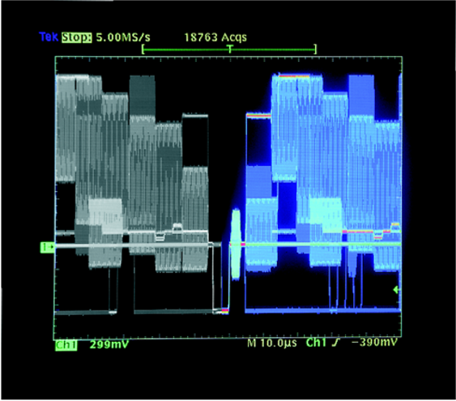
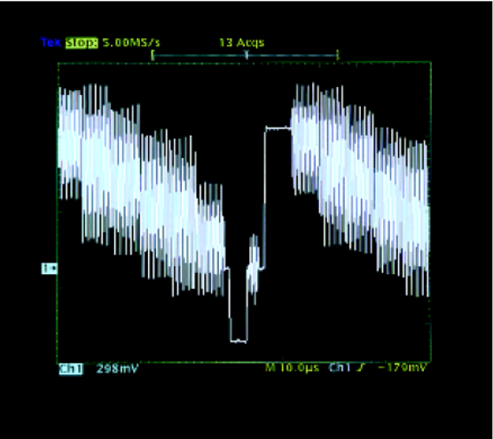
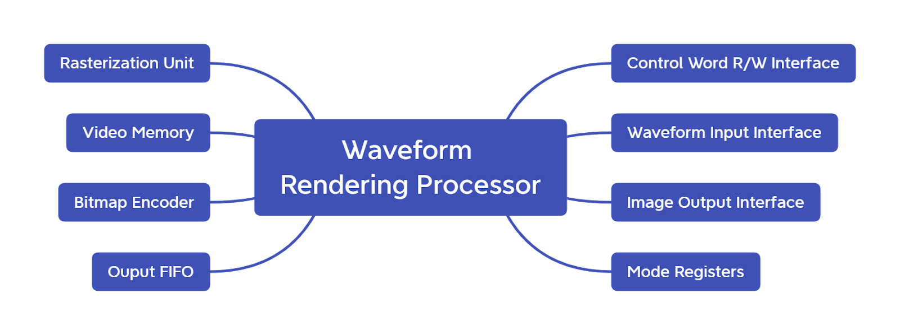

### Waveform Rendering Processor (similar to Tektronix's DPX Processor)

- ### Overview

  Waveform Rendering Processor is composed of an application-specific integrated circuit (ASIC) applied in digital phosphor oscilloscope. The input signal is first amplified and converted by A/D to obtain the sampling value of the signal. The sampling value is processed to form a complete streamer waveform diagram with 500*200 pixels and three-dimensional information of the waveform. During the capture process, the DPX imaging processor sends 30 waveform images to the waveform display memory per second.

  - Digital oscilloscope with DPX

    

  - Digital oscilloscope without DPX

    

- ### Components

  ****
